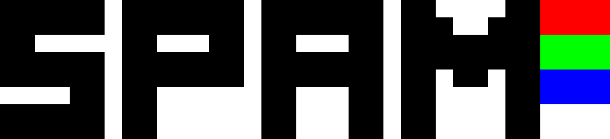

Simple Pixel Art Maker - spam creates pixel art images from simple text files.

# Principle

Spam converts ascii text files to pixel art images. Each letter corresponds to a colored pixel.
For example, here is the source file for the logo above:

```
aaaaaawaaaaaaawaaaaaaawaawwwwaarrrr
aaaaaawaaaaaaawaaaaaaawaaawwaaarrrr
aawwwwwaawwwaawaawwwaawaaaaaaaagggg
aaaaaawaaaaaaawaaaaaaawaaaaaaaagggg
aaaaaawaaaaaaawaaaaaaawaawaawaabbbb
wwwwaawaawwwwwwaawwwaawaawwwwaabbbb
aaaaaawaawwwwwwaawwwaawaawwwwaawwww
aaaaaawaawwwwwwaawwwaawaawwwwaawwww
```

Waw! this is hard to read.

Here is the color - letter chart:

| ASCII | Color |
|---|---|
| . | transparent pixel |
| w | white |
| a | black |
| r | red |
| g | green |
| b | blue |

For now, these are the only colors available but I plan to implement custom color palettes.

# Usage

For now, spam is a terminal application.
It offers two functionnalities :
* Create a template of a given size (filled with dots)
* Convert a text file to a png and resize it by a given factor

Don't worry if some line or columns of source file are not the same length, spam will fill the blanks with transparent pixels.
In fact, the source text file can be of any size, spam will read the number of pixel you wrote.

# Future improvements

* Cleanup cli/main
* Implement palettes with flexible configuration file mapping ascii (or unicode even) to colors
* Make a better logo with palettes
* Documentation

